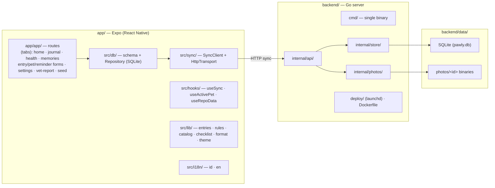
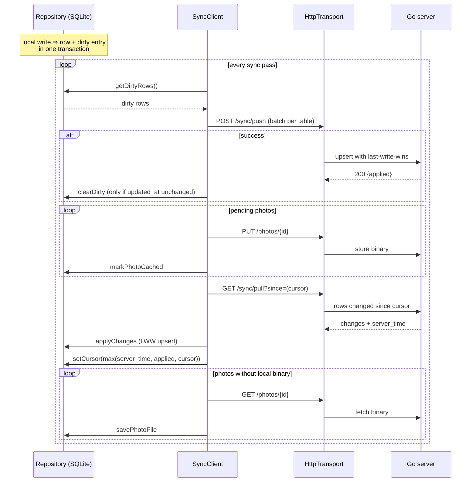

# Pawly

A pet life log for your whole household — cats, dogs, and everyone else. Log
the everyday (food, water, walks), the health stuff (weight, vaccines, meds,
vet visits, symptoms), and the moments (photos, milestones, gotcha day), and
walk into the vet with a 30-day report already written.

**Optimize for relationship.** Journal is the chronological truth; Memories is
the emotional destination — same data, two surfaces.

**Local-first.** The phone is the source of truth and works fully offline;
a small home server on your LAN keeps every device and a backup copy in sync.

## Architecture



The app persists everything in a local SQLite database (`expo-sqlite`, WAL) and
serves the UI from it. The Go server is optional — it exists only to sync
between devices and keep a second copy of the data. No account, no cloud.

## Repo layout

```
app/       Expo (React Native) app — 4 tabs, SQLite local-first, en/id i18n,
           vitest suite (sql.js in-memory DB, E2E vs real server)
backend/   Go home server — single binary, SQLite, last-write-wins sync,
           photo binaries, Dockerfile, launchd service for macOS
assets/    screenshots (README/UI reference)
```

## Data model

Four synced tables; everything else on the phone is local bookkeeping.

| Table | Purpose |
|---|---|
| `pets` | name, species (cat/dog/other), sex, dates, story, status (alive/passed), vet clinic |
| `events` | the unified journal — kind (feed, water, walk, potty, mood, checkin, symptom, med_given, vaccine, visit, weight, photo, milestone, task, vet_bill), title, text, occurred_at, next_due_at, JSON `data`, favorite |
| `photos` | metadata rows; binaries live on the server at `data/photos/<id>` and in the app photo cache |
| `reminder_rules` | title, kind, due, repeat (once/daily/weekly/monthly), dose, note; completions are `task` events referencing the rule id in their `data` |

- Every row shares `id` (UUID), `created_at`, `updated_at`, `deleted_at`.
- **Soft deletes only** — deleting tombstones the row (`deleted_at` set) and
  syncs the tombstone; rows are never physically removed.
- Deletes cascade on the client: removing a pet tombstones its events,
  photos, and reminder rules in one transaction.
- Timestamps are RFC3339 UTC with milliseconds (`2026-08-08T09:30:00.000Z`) —
  lexicographic order is chronological, which LWW depends on.
- The server treats the events `data` column as an opaque string; schema
  evolution happens on the client.

Local-only tables: `dirty` (rows pending push), `photo_cache` (pending →
cached photo files), `sync_state` (pull cursor).

## Sync flow

One sync pass, orchestrated by `SyncClient` (`app/src/sync/client.ts`):



1. **Every local write is dirty-marked** (`Repository.upsertLocal` writes the
   row and inserts into `dirty` in one transaction).
2. **Push** — dirty rows are batched per table and POSTed. Only on success are
   they cleared — and only when `updated_at` is unchanged (an edit made
   mid-sync keeps the row dirty for the next pass).
3. **Photos** — pending photo binaries are uploaded (row must exist first;
   failures stay pending and retry next pass).
4. **Pull** — `GET /sync/pull?since=<cursor>` returns every row changed since
   the last-seen timestamp, plus the server's clock (`server_time`).
   Rows are upserted with LWW; the new cursor is `max(server_time, newest
   applied row, previous cursor)` — applied rows only, so a row that lost
   LWW locally never respawns a refetch loop.
5. **Downloads** — photo rows with no local binary are fetched into the photo
   cache. Missing/failed items are retried on the next pass.

**Triggers:** the `SyncProvider` (`app/src/hooks/useSync.tsx`) syncs on app
foreground, network reconnect, and first mount; Settings has a manual
"sync now". No background jobs.

**Server side** (`backend/internal/store` + `api`):

- Upserts are LWW: `INSERT ... ON CONFLICT(id) DO UPDATE SET ... WHERE
  table.updated_at < excluded.updated_at`.
- Push validates columns against an allow-list, parses timestamps strictly
  (400 on bad shapes), defers FK checks to commit so intra-batch ordering
  doesn't matter, and rolls back the whole batch on any error.
- Stale `updated_at` values are clamped to server time on push, so a
  clock-behind device's rows never fall behind another device's pull cursor.
- Tombstoned photo binaries are swept from disk at startup and hourly; the
  row itself stays for sync.
- CORS is wide open — the server is a private home device (the Expo web
  build needs it; native clients ignore the headers).

## Server

Single Go binary + SQLite (modernc.org/sqlite — no CGO). Endpoints:

| Method | Path | Purpose |
|---|---|---|
| GET | `/healthz` | Liveness check (the app pings this to detect the server) |
| GET | `/sync/pull?since=<RFC3339>` | All rows changed since a timestamp |
| POST | `/sync/push` | Batch of changed rows; last-write-wins |
| PUT | `/photos/{id}` | Upload a photo binary (max 20 MB) |
| GET | `/photos/{id}` | Download a photo binary |

Config: `PAWLY_PORT` (default 8080), `PAWLY_DATA_DIR` (default `./data`), read
from `.env`, environment, or flags (`-port`, `-data-dir`) — flags win. Data
lives in `backend/data/pawly.db` + `backend/data/photos/` (gitignored). See
`backend/README.md` for Docker, launchd, and backup details.

## Run it

```bash
# server (optional; sync only — the app works fully offline without it)
cd backend && go build -o pawly ./cmd && ./pawly

# app
cd app && cp .env.example .env  # optional: pin the server URL (see below)
pnpm install && pnpm web        # web prototype at phone size
pnpm ios / pnpm android         # native (Expo Go / simulator)
```

In the app, Settings → Server address → `192.168.1.50:8080` (your Mac's LAN IP).

**Server auto-detection** (`app/.env`, all `EXPO_PUBLIC_*` are inlined into the
app bundle):

- `EXPO_PUBLIC_PAWLY_URL=http://192.168.1.50:8080` — pin the backend. When set
  it is authoritative: health-checked via `/healthz` and used as-is, no LAN scan.
- `EXPO_PUBLIC_PAWLY_AUTO_DETECT=true` — with no URL configured anywhere, the
  app probes the local network for a Pawly server (`GET /healthz` on each host,
  port `EXPO_PUBLIC_PAWLY_PORT`, default `8080`) and remembers the winner.
- `EXPO_PUBLIC_PAWLY_PORT=8080` — port probed during auto-detection; matches
  the server's `PAWLY_PORT`.

## Verify

```bash
cd app && pnpm typecheck && pnpm test     # 15 files, 102 tests
cd backend && go test ./...               # 43 tests incl. two-device convergence
```

The E2E test needs a server binary first:

```bash
cd backend && go build -o /tmp/pawly-e2e ./cmd
```

Tests: app unit tests run on sql.js (in-memory SQLite, same `Db` facade);
`server-e2e.test.ts` boots a real Go server and syncs real rows and photo
bytes. Backend tests cover LWW, push validation, clock clamping, photo GC,
and a two-device convergence scenario.
